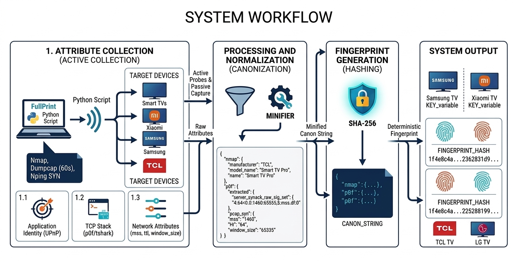

# IoT-ID: Deterministic Device Identity from Hybrid Network Fingerprinting

**IoT-ID** is a prototype tool for identifying IoT devices through deterministic fingerprints derived from TCP/IP stack characteristics.

The tool combines **active probing** and **passive traffic analysis** to extract stable network features, which are then canonicalized and hashed using SHA-256. The resulting fingerprint represents a reproducible identity of the device, independent of IP address and resilient to MAC address randomization.

This artifact accompanies the paper submitted to **SBRC 2026** and targets the SBC reproducibility badges described in [Badges](#badges).

---

## Table of Contents

1. [Overview](#overview)
2. [Repository Structure](#repository-structure)
3. [Badges](#badges)
4. [Requirements](#requirements)
5. [Installation](#installation)
6. [Docker](#docker)
7. [Minimal Working Example](#minimal-working-example)
8. [Output Artifacts](#output-artifacts)
9. [Reproducibility and Experiments](#reproducibility-and-experiments)
10. [SBRC Demonstration Plan](#sbrc-demonstration-plan)
11. [Security and Ethical Considerations](#security-and-ethical-considerations)
12. [License](#license)

---

## Overview

IoT-ID implements a hybrid fingerprinting pipeline composed of seven stages:

1. Active scanning using `nmap` (including UPnP discovery)
2. Controlled packet capture with `dumpcap`
3. TCP SYN probing via `nping`
4. Passive fingerprint extraction using `p0f`
5. TCP feature extraction from PCAP using `tshark`
6. Canonicalization of stable features
7. SHA-256 hash generation

The goal is to produce a **deterministic and reproducible device identity** based solely on network behavior.

The figure below illustrates the four main phases of the pipeline: attribute collection
(active probing via nmap/nping + passive capture), processing and normalization
(canonicalization), fingerprint generation (SHA-256 hashing), and system output
(deterministic device identity).



---

## Repository Structure

```
sbrc26_fingerprint/
├── iot_id_fingerprint.py      # Backward-compatible CLI wrapper for the pipeline
├── iot_net_scanner.py         # Backward-compatible CLI wrapper for network discovery
├── canonicalize_features.py   # Backward-compatible CLI wrapper for canonicalization
├── fingerprint_hash.py        # Backward-compatible CLI wrapper for offline hashing
├── iot_fingerprint/           # Internal package with cohesive implementation modules
│   ├── canonical.py           # Canonical feature policy and deterministic serialization
│   ├── hashing.py             # Hash computation and offline hash CLI logic
│   ├── pipeline.py            # Main orchestration for target/network fingerprinting
│   ├── upnp.py                # Shared SSDP/UPnP/Nmap/ARP discovery helpers
│   ├── p0f.py                 # p0f raw parser and stable set extraction
│   ├── tshark_features.py     # TCP SYN/SYN+ACK and passive tshark extraction
│   ├── mobile.py              # Mobile-only evidence outside the canonical hash
│   └── runtime.py             # Process, logging, filesystem and formatting helpers
├── fingerprint_subnet.sh      # Batch script for subnet-wide fingerprinting
├── requirements.txt           # Python dependencies
├── Dockerfile                 # Container image definition
├── docker-compose.yml         # Docker Compose configuration (host networking + capabilities)
├── docs/                      # Documentation assets (e.g., workflow diagram)
├── testes/                    # Test scripts and validation data
├── runs/                      # Output directory (created at runtime)
└── README.md                  # This file
```

---

## Badges

This artifact targets the following SBRC badges:

| Badge | Description |
|---|---|
| **Available (SeloD)** | The artifact is publicly available in this repository. |
| **Functional (SeloF)** | The artifact runs and produces the expected outputs. |
| **Sustainable (SeloS)** | The code is documented, modular, and can be adapted to other scenarios. |
| **Reproducible (SeloR)** | Results can be reproduced under the conditions described in [Reproducibility and Experiments](#reproducibility-and-experiments). |

---

## Requirements

### Execution Environment

| Component | Specification |
|---|---|
| Operating System | Linux (Ubuntu 20.04 LTS or newer recommended) |
| Python | 3.8 or higher |
| Network | Local network (LAN) with access to target devices |
| Privileges | `sudo` required for packet capture and active probing |

### Hardware

| Resource | Minimum |
|---|---|
| CPU | 2 cores |
| RAM | 4 GB |
| Disk | 1 GB free |

### System Dependencies

| Tool | Version | Purpose |
|---|---|---|
| nmap | 7.95 | Active scanning and UPnP discovery |
| nping | 0.7.95 | TCP SYN probing |
| dumpcap | 4.4.15 | Packet capture |
| tshark | 4.4.15 | TCP feature extraction |
| p0f | 3.09b | Passive fingerprinting |

## Installation

### 1. Install system dependencies (Ubuntu / Debian)

```bash
sudo apt update
sudo apt install -y nmap wireshark-common tshark p0f python3 python3-pip python3-venv
```

---

### 2. Clone the repository

```bash
git clone https://github.com/GT-IoTEdu/sbrc26_fingerprint.git
cd sbrc26_fingerprint
```

### 3. Set up the Python environment

```bash
python3 -m venv .venv
source .venv/bin/activate
pip install -r requirements.txt
```

> **Note:** All Python dependencies must be installed **after** activating the
> virtual environment. Do not run `pip install` before the `source .venv/bin/activate` step.

---

### Running with sudo

Some pipeline stages (packet capture, active scanning) require root privileges.
Because `sudo` creates a clean session that does not inherit the active virtual
environment, you must explicitly pass the virtual environment's interpreter:

```bash
# Activate the virtual environment first
source .venv/bin/activate

# Then run with sudo using the venv interpreter
sudo $(which python3) iot_id_fingerprint.py runs  --seconds 60 --iface 
```

> **Why `$(which python3)`?** With the virtual environment active, `which python3`
> resolves to `.venv/bin/python3`, ensuring that `sudo` uses the correct interpreter
> and all installed dependencies are available.

---

## Docker

For Linux environments, IoT-ID can run inside a Docker container with host
networking and packet-capture capabilities, eliminating manual dependency setup.

> ⚠️ **Linux only.** `network_mode: host` is a Linux-specific Docker feature.
> This setup does **not** work on macOS or Windows.

### Prerequisites

Docker and Docker Compose must be installed on the host:

```bash
# Install Docker
sudo apt update
sudo apt install -y docker.io docker-compose-plugin

# Optional: To run Docker without `sudo`, add your user to the `docker` group and restart the session:
sudo usermod -aG docker $USER
newgrp docker
```

### Build

```bash
docker compose build
```

### Run a single target

```bash
docker compose run --rm fingerprint runs <TARGET_IP> \
    --seconds 60 --iface <INTERFACE> --cleanup
```

**Example:**

```bash
docker compose run --rm fingerprint runs 192.168.1.50 \
    --seconds 60 --iface enp0s3 --cleanup
```

### Run subnet orchestrator

```bash
docker compose run --rm --entrypoint bash fingerprint \
    ./fingerprint_subnet.sh -i <INTERFACE> -s 60 --cleanup
```

### Technical notes

| Setting | Value | Reason |
|---|---|---|
| `network_mode` | `host` | Required for capture/probing tools to access LAN traffic directly |
| `NET_ADMIN` | enabled | Required for network interface configuration |
| `NET_RAW` | enabled | Required for raw packet capture |
| Output persistence | `./runs` on host | Output files are mounted and persisted outside the container |

> **Tip:** The `--cleanup` flag is recommended when using Docker to avoid
> accumulating large `.pcap` files in the `./runs` directory on the host.

---

## Minimal Working Example

### Step 1 — Discover devices on the local network

 ```bash
  sudo python3 iot_net_scanner.py
```

**Expected output:**

```bash
[*] Starting Network Scanner...
    (Full network scan)

=================================================================
DEVICE INVENTORY
=================================================================
IP: 192.168.59.106 | MAC: D0:76:02:F5:81:9C
   Name: Smart TV Pro
   Manufacturer: TCL
   Model Name: Smart TV Pro
   UDN: uuid:25f02330-1d54-ad02-544c-99ffb213ca35
   SERVER: UPnP/1.0, DLNADOC/1.50 Platinum/1.0.5.13
--------------------------------------------------
...
```

### Step 2 — Generate a fingerprint for a specific device

```bash
sudo python3 iot_id_fingerprint.py runs <TARGET_IP> --seconds <SECONDS> --iface <INTERFACE>
```

**Parameters:**

| Parameter | Description |
|---|---|
| `runs` | Output directory where artifacts will be saved |
| `<TARGET_IP>` | IP address of the target device |
| `<SECONDS>` | Duration of passive packet capture |
| `<INTERFACE>` | Network interface used for monitoring (e.g., `enp0s3`, `eth0`) |
| `--cleanup` *(optional)* | Removes unnecessary intermediate data generated during execution after the pipeline finishes, keeping only the relevant output artifacts. When enabled, it removes raw artifacts such as `.pcap` and `p0f.raw.txt` at the end of each execution. |

**Example:**

```bash
sudo python3 iot_id_fingerprint.py runs 192.168.59.106 \
    --seconds 60 --iface enp0s3
```

**Expected output:**

```bash
VirtualBox:~ sudo python3 iot_id_fingerprint.py runs 192.168.59.106 --seconds 60 --iface enp0s3
[*] Running Nmap ...
[*] UPnP identity detected ...
[*] Capturing PCAP with dumpcap (async) ...
[*] Probing common ports with nping SYN (ports=80,443,22,445,139,3389,8080,8443,9100,5357, count=3) ...
[*] Running p0f (native) (offline -r) ...
[*] Extracting SYN/SYN+ACK TCP features from PCAP via tshark ...

=== CANON_STRING ===
{"nmap":{"manufacturer":"TCL","model_name":"Smart TV Pro","name":"Smart TV Pro","server":"UPnP/1.0, DLNADOC/1.50 Platinum/1.0.5.13"},"p0f":{"extracted":{"server_synack_raw_sig_set":["4:64+0:0:1460:65535,0:mss:df:0"]}},"pcap_syn":{"mss":"1460","ttl":"64","window_size":"65535"}}

=== FINGERPRINT_HASH ===
e20c48257b98e86fa11d7c4444e7e5da7176a1b328719ea5f46f831951392d51

[OK] Saved:
  runs/192.168.59.106_20260324_214710/features_canon.json
  runs/192.168.59.106_20260324_214710/features_canon.txt
  runs/192.168.59.106_20260324_214710/fingerprint_sha256.txt

[OK] Bundle salvo em:
 /home/carregando/fullprint/runs/192.168.59.106_20260324_214710

[OK] Log de pipeline: runs/192.168.59.106_20260324_214710/fingerprint_pipeline.log

=== TIMING (rodada) ===
nmap              : 1m 36.79s
dumpcap_capture   : 1m 00.26s
nping_probe       : 29.11s
p0f_native        : 13.5 ms
tshark_syn_fallback: 2.01s
canon_plus_hash   : 0.8 ms
TOTAL             : 2m 39.10s
```
## Output Artifacts

Each execution creates a timestamped subdirectory under `runs/` (format: `<IP>_<YYYYMMDD>_<HHMMSS>/`) containing the following files:

| File | Description |
|---|---|
| `features_canon.json` | Human-readable JSON with the canonical feature subset (from `nmap`, `p0f`, and `pcap_syn`, depending on host type and policy). |
| `features_canon.txt` | Single-line **CANON_STRING** (compact JSON, UTF-8) used as the input to the hash function. |
| `fingerprint_sha256.txt` | Single-line SHA-256 fingerprint in lowercase hexadecimal. |
| `fingerprint_pipeline.log` | Detailed log of pipeline stages, execution times, and errors (for debugging). |
| `*.pcap` | Raw packet capture file generated during the passive analysis stage. |

> **Mapping to paper tables:** The fields present in `features_canon.txt`
> (`manufacturer`, `model_name`, `mss`, `ttl`, `window_size`) correspond
> directly to the attribute columns in Table 4 of the paper. The hash in
> `fingerprint_sha256.txt` corresponds to the SHA-256 column in Table 5.
---

## Reproducibility and Experiments

This section describes how to reproduce the main claims of the paper.

---

### Claim #1 – Deterministic Fingerprints

**Objective:** Verify that fingerprint values remain stable across multiple executions on the same device.

**Procedure:**

```bash
cd /fingerprint
chmod +x fingerprint_subnet.sh
./fingerprint_subnet.sh
```
By default, the script runs **5 fingerprint passes per discovered IP** (each pass produces a distinct timestamped folder). To change the number of passes, use the `-r` option:

```bash
./fingerprint_subnet.sh -r 1   # one pass per host
./fingerprint_subnet.sh -r 10  # ten passes per host
```

**Expected behavior:** Identical SHA-256 fingerprints across all executions for the same device.

### Evaluated Devices

The table presents the devices evaluated in the original study, including their categories, manufacturers, models, and the respective quantities used in the tests.

| Device        | Manufacturer         | Model                      | Qty. |
|---------------|----------------------|----------------------------|------|
| Game Console  | Microsoft            | Xbox One                   | 1    |
| IP Camera     | TP-Link              | C500 (Model A)             | 3    |
| IP Camera     | Vlx LED EXcelente    | Speed Dome Solar (Model B) | 1    |
| Router        | FiberHome            | HG6143D                    | 1    |
| Router        | TP-Link              | EC220-G5                   | 1    |
| Smart Bulb    | Avant NEO            | RGB E27                    | 1    |
| Smart TV      | TCL                  | UnionTV                    | 1    |
| Smart TV      | TCL                  | Smart TV Pro               | 1    |
| Smart TV      | Samsung              | UN32J4303                  | 2    |
| Smart TV      | Samsung              | QN55Q60TAGXZD              | 1    |
| TV Box        | Xiaomi               | MiTV-AESP0                 | 1    |
| Wi-Fi Printer | HP                   | Deskjet 4640               | 1    |

### Reference Fingerprints

| Device                     | SHA-256 Fingerprint                                              |
|----------------------------|------------------------------------------------------------------|
| TV TCL (UnionTV)           | 994f131342176c20415565dab0adf2666b160422d3df1511c0a37ae135985add |
| Router FiberHome           | 14407342dc69a801f52f6cead97d00e5260b7206072f145e6fde19e07cb1f157 |
| Smart Bulb                 | 993e9afc860d624a332822679ea4efc3490c2734ba84ad160c8d36abf0d546f7 |
| TV TCL (Smart TV Pro)      | e20c48257b98e86fa11d7c4444e7e5da7176a1b328719ea5f46f831951392d51 |
| TV Samsung (1)             | 1f4e8c4af2be567b929cf5b7409c57d648ea062262eeab566e11e32c1b437e94 |
| TV Xiaomi                  | 6397f4729927379fde73d5c1ea234ef1070d3785b4f271c562fa4cb688be2d48 |
| TV Samsung 55"             | 410528d091cb14cea300d79e74348087fc3a1b351584c919650c3a6f24ec18d1 |
| Printer                    | 93ef878c8f2de4eab5a5c780b1dc146d28df337116d8e93019bd9f4cc78c41df |
| Xbox One                   | 50f1736613c079a70b2d094c680cd8f9027adeb34ca7e90e7c4322a73492eb01 |
| TV Samsung (2)             | 1f4e8c4af2be567b929cf5b7409c57d648ea062262eeab566e11e32c1b437e94 |
| Router TP-Link             | dce0ee76d22f60bec93ce4f6478a9ffe439b2b6e914bafbafe0048685402b2cc |
| IP Camera Model A (1)      | c61f28839b696b65307cef2db341e976fadf10012d9c0f01f6a490b1e3e5742f |
| IP Camera Model A (2)      | c61f28839b696b65307cef2db341e976fadf10012d9c0f01f6a490b1e3e5742f |
| IP Camera Model A (3)      | c61f28839b696b65307cef2db341e976fadf10012d9c0f01f6a490b1e3e5742f |
| IP Camera Model B          | 5b60133e2971f571f7a4ceadd55041a78771b65189e64c0f891eb687ab37bc74 |
---

Note that **identical models produce identical fingerprints** (e.g., the three TP-Link C500 cameras and the two Samsung UN32J4303 TVs), which empirically supports the determinism claim.

---

### Claim #2 – Cross-Device Collision Resolution via L7 Attributes

**Objective:** Verify that IoT-ID can distinguish devices with identical L3/L4
signatures by incorporating application-layer (L7) metadata collected via
UPnP/nmap (Table 4 of the paper).

**Context:** The Xiaomi MiTV, TCL TVs, and TP-Link Router share identical
TCP/IP attributes (MSS=1460, TTL=64, window_size=65535 or similar). Under
traditional passive fingerprinting, these devices would be indistinguishable.
IoT-ID resolves the ambiguity by incorporating `manufacturer` and `model_name`
via UPnP.

**Prerequisites:**

- Two or more devices with similar TCP/IP stacks available on the local network
- Environment configured as described in the **Installation** section

**Procedure:**

**Step 1 — Collect the fingerprint of the first device:**

```bash
sudo python3 iot_id_fingerprint.py runs <IP_DEVICE_A> --seconds 60 --iface <INTERFACE>
```

**Step 2 — Collect the fingerprint of the second device:**

```bash
sudo python3 iot_id_fingerprint.py runs <IP_DEVICE_B> --seconds 60 --iface <INTERFACE>
```

**Step 3 — Compare the generated canon strings:**

```bash
cat runs/<IP_DEVICE_A>_*/features_canon.txt
cat runs/<IP_DEVICE_B>_*/features_canon.txt
```

**Step 4 — Compare the final hashes:**

```bash
cat runs/<IP_DEVICE_A>_*/fingerprint_sha256.txt
cat runs/<IP_DEVICE_B>_*/fingerprint_sha256.txt
```

**Expected Result:**

The `features_canon.txt` files for both devices should show identical or very
similar L3/L4 values (`mss`, `ttl`, `window_size`), but **distinct canon strings**
due to the L7 fields (`manufacturer`, `model_name`). The final SHA-256 hashes
must be **different**, confirming that the application layer resolves the collision.

Example extracted from the paper (Tables 4 and 5):

| Device                | MSS  | TTL | Window | SHA-256                                                           |
|-----------------------|------|-----|--------|-------------------------------------------------------------------|
| TV TCL (Smart TV Pro) | 1460 | 64  | 65535  | `e20c48257b98e86fa11d7c4444e7e5da7176a1b328719ea5f46f831951392d51`|
| TV Xiaomi             | 1460 | 64  | 65535  | `6397f4729927379fde73d5c1ea234ef1070d3785b4f271c562fa4cb688be2d48`|
| TV TCL (UnionTV)      | 1460 | 64  | 65535  | `994f131342176c20415565dab0adf2666b160422d3df1511c0a37ae135985add`|

Despite identical L3/L4 attributes, the three devices produce distinct fingerprints
thanks to the L7 metadata collected via UPnP.


### Reproducibility Notes

Strict reproducibility in this artifact depends on the availability of the **same physical IoT devices**, which cannot be perfectly replicated across different environments. For this reason, two complementary modes of reproducibility are supported:

1. **Strict reproducibility:** Achievable only when the exact same devices, with the same firmware versions, are tested. In this case, the SHA-256 hashes listed above must match exactly.
2. **Functional and comparative reproducibility:** Achievable in any environment with networked devices. The user can validate the following expected behaviors:
   - The same device produces a **stable fingerprint** across multiple runs.
   - **Different devices** produce **distinct fingerprints**.
   - **Identical device models** produce **identical fingerprints**.

For best results, experiments should be conducted in a stable network environment, since intense or anomalous traffic may temporarily affect captured features.

---

## SBRC Demonstration Plan

This section describes the requirements and planning for the SBRC demonstration, including the necessary setup to effectively showcase the tool.

### Lab Setup

* A Linux machine or Linux virtual machine (with bridged networking, when applicable) connected to the same subnet as the target devices.
* Devices available on the same LAN (e.g., smart TVs, IoT devices), preferably active during the demonstration.
* All system and Python dependencies installed (see [Requirements](#requirements)).
* `sudo` privileges for packet capture and active probing.

### Demonstration Flow

1. **Network discovery:** Identify active devices using `iot_net_scanner.py`, either across the entire network or targeting a specific IP range.

2. **Fingerprint generation:** Execute the fingerprinting pipeline against a selected device using:
  `sudo python3 iot_id_fingerprint.py runs <TARGET_IP> --seconds <SECONDS> --iface <INTERFACE>`

  Each parameter is explained in [Minimal Working Example](#minimal-working-example).

3. **Determinism check:** Run the pipeline a second time on the same device and compare the resulting SHA-256 hash.
   
4. **Comparative analysis:** Run the pipeline on a different device and show that the fingerprint differs.

### Notes for Virtualized Environments
  When running inside a virtual machine, the hypervisor must be configured to allow **promiscuous mode** on the network interface (e.g., the "Allow All" setting in VirtualBox, or equivalent in VMware). Without this, packet capture and passive fingerprinting will not work correctly.

Promiscuous mode and `sudo` are required because:
- Raw packet capture requires elevated privileges.
- Promiscuous mode allows the interface to capture all traffic on the network segment, not only frames addressed to the host.

---

## Security and Ethical Considerations

⚠️ **IoT-ID performs active probing and packet capture.** Use it responsibly.

The tool generates TCP SYN traffic, captures network packets (PCAP), and may trigger IDS/IPS alerts on managed networks.

**Recommended practices:**

- Use the tool **only in controlled and authorized environments**.
- **Do not run** the tool on networks for which you do not have explicit authorization.
- Ensure compliance with institutional and legal policies regarding network monitoring.
- Treat captured PCAP files as potentially sensitive data.

---

## LICENSE

Copyright (c) 2025 RNP – National Research and Education Network (Brazil)

This code was developed under the *Hackers do Bem* Program and is licensed under the terms of the **BSD License**. It may be freely used, modified, and distributed, including for commercial purposes, provided that this copyright notice is retained.
This software is provided "as is", without any warranty, express or implied, including, but not limited to, warranties of merchantability or fitness for a particular purpose. RNP and the authors shall not be held liable for any damages or losses arising from the use of this software.
